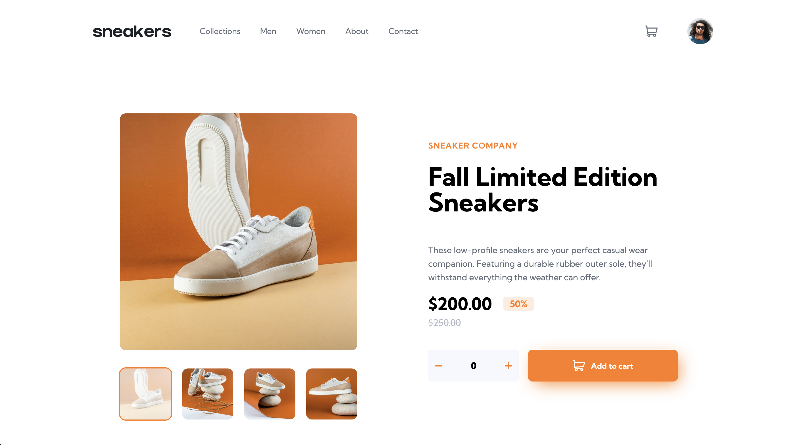

# Frontend Mentor - E-commerce product page solution

This is a solution to the [E-commerce product page challenge on Frontend Mentor](https://www.frontendmentor.io/challenges/ecommerce-product-page-UPsZ9MJp6). Frontend Mentor challenges help you improve your coding skills by building realistic projects.

## Table of contents

- [Overview](#overview)
    - [The challenge](#the-challenge)
    - [Screenshot](#screenshot)
    - [Links](#links)
- [My process](#my-process)
    - [Built with](#built-with)
    - [What I learned](#what-i-learned)
    - [Continued development](#continued-development)
    - [Useful resources](#useful-resources)
- [Author](#author)

## Overview

### The challenge

Users should be able to:

- View the optimal layout for the site depending on their device's screen size
- See hover states for all interactive elements on the page
- Open a lightbox gallery by clicking on the large product image
- Switch the large product image by clicking on the small thumbnail images
- Add items to the cart
- View the cart and remove items from it

### Screenshot



### Links

- Solution URL: [Solution URL](https://github.com/amjadsh97/rest-countires-api)
- Live Site URL: [Live site](https://rest-countires-api.vercel.app/)

## My process

### Built with

- Semantic HTML5 markup
- CSS custom properties
- Flexbox.
- [React](https://reactjs.org/) - JS library.

### What I learned

In this project, I leveraged the React Context API to manage state, and I discovered its immense utility in streamlining state management across components.

Additionally, I implemented a carousel feature from scratch, opting not to rely on existing libraries. The process proved to be both challenging and rewarding, ultimately leading to a more customized and tailored solution.

#### Javascript code
```js
//Handle the state on the app.
const StateContext = createContext();

export const useStateContext = () => useContext(StateContext);

export const StateProvider = ({ children }) => {
	const [productDetails, setProductDetails] = useState({ count: 0, price: 200 });
	const [numberProducts, setNumberProducts] = useState(0)

	return (
		<StateContext.Provider value={{ productDetails, setProductDetails, numberProducts, setNumberProducts }}>
			{children}
		</StateContext.Provider>
	);
};
```

#### CSS code
```css

```

### Continued development

In the future, I will prioritize further developing my skills in using context api more on react apps.

### Useful resources

- [React Docs](https://react.dev/) - This helped me for building react components. I really liked using this docs.

## Author

- Website - [Amjad Shadid](https://amjadshadid.vercel.app/)
- Frontend Mentor - [@amjadsh97](https://www.frontendmentor.io/profile/amjadsh97)
- Twitter - [@Amjadshadid](https://twitter.com/Amjadshadid)
- Linkedin - [@Amjad Shadid](https://www.linkedin.com/in/amjad-shadid-134355134/)